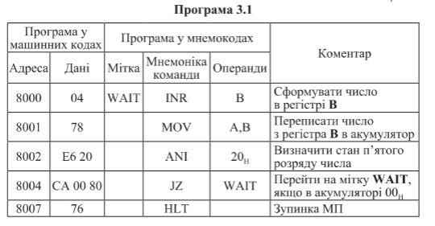

#### Самойленко Володимир Миколайович

<p align="center">
  
</p>

```
І.
Видозмінити програму 3.1 таким чином, щоб мікроЕОМ припиняла виконання програми при наявності 0 у п'ятому розряді й 1 у всіх інших розрядах досліджуваного числа.

8000 04     ; INR B
8001 78     ; MOV A,B

8002 FE     ; CPI EFh ( 1110 1111 )
8003 EF

8004 CA     ; JZ immediate_end ( if Areg - EFh == 0 => Z_flag = 1 )
8005 xx
8006 XX
...
...
...

immediate_end
XXxx 76     ; HLT

* якщо умова не вірна то можна виконувати програму далі, адресація довільна 
( залежить від програми у якій буде перевірятися ця умова ).
```
<div style="page-break-after: always;"></div>

```
ІІ.
Скласти програму запису одиниць в усі розряди регістра С, якщо число, cформоване в регістрі В, більше 3.

8000 78        ; MOV A, B

8001 FE        ; CPI 04h
8002 04

8003 D2        ; JC end (if B < 4) | C_flag = 1
8004 07
8005 80

8006 3E        ; MVI C, FFh (if B >= 4) | ( C_flag = 0)
8007 FF

end:
8008 76        ; HLT

```

```
IІІ.
Скласти програму запису одиниць в усі розряди регістра С, якщо число, cформоване в регістрі В, більше 3, але менше 8.

8000 78        ; MOV A, B

8001 FE        ; CPI 04h
8002 04

8003 D2        ; JC immediate_end (B < 4)
8004 0C
8005 80

8006 FE        ; CPI 08h
8007 08

8008 DA        ; JC continue (B < 8)
8009 0C
800A 80

immediate_end:
800B 76        ; HLT

continue:
800C 3E        ; MVI C, FFh
800D FF
800E 76        ; HLT

```