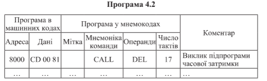
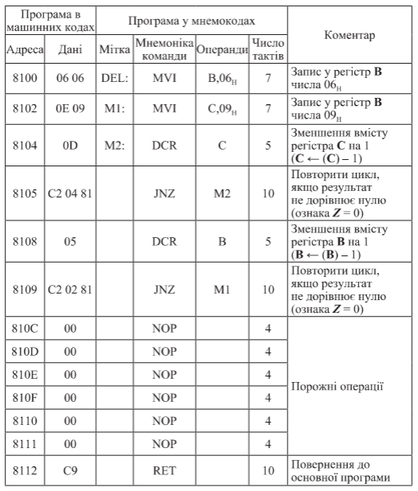
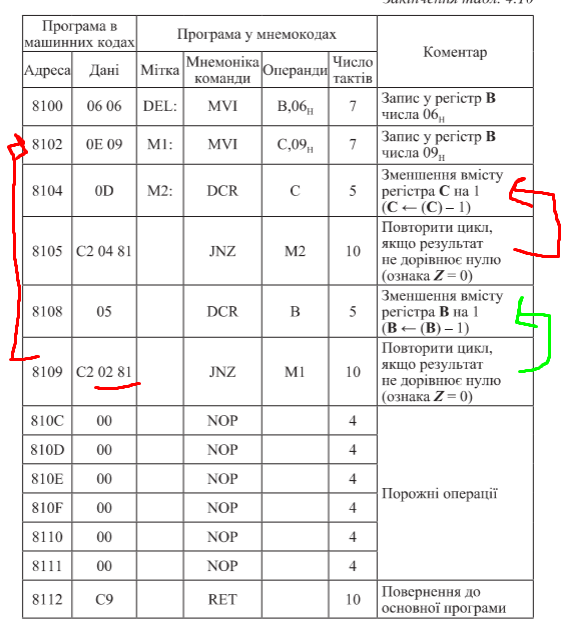

#### Самойленко Володимир Миколайович, n = 9 

<p align="center">
  
  
  
</p>

<div style="page-break-after: always;"></div>

```
Дослідити програму 4.2 регульованої часової затримки. Модифікувати для здійснення часової затримки на час 50*N ( 450 ) мкс, де n - порядковий номер студента в журналі групи.

500 мкс = 1000 тактів => 450 мкс = 900 тактів

8000 CD     | CALL 
8001 00
8002 81                                 * 17 tacts 
...
8100 06     | MVI: 06 -> B
8101 06                                 * 7 tacts

8102 0E     | MVI: 09 -> C
8103 09                                 * 7 tacts
                                                                    = 31 tacts
                                                                 
8104 0D     | DCR: C - 1                * 5 x 9 = 45 tacts
8105 C2     | JNZ 8104 ( if C ≠ 0 )     * 8 x 10 = 80 tacts ( - 9 time)
8106 04
8107 81
                                                                    = 125 tacts

8108 05     | DCR: B - 1                * 5 x 6 = 30 tacts
8109 C2     | JNZ 8108 ( if C ≠ 0 )     * 5 x 10 = 50 tacts ( - 6 time)
810A 08
810B 81 
                                                                    = 80 tacts

810C 00
810D 00
810E 00
810F 00
8110 00
8111 00                                  * 4 x 6 = 24 tacts       

8112 C9     | RET                        * 10 tacts 
                                                                    = 34 tacts

=> 31 + 125 + 80 + 34 = 65 + 125 + 80 = 270 tacts => 135 мкс затримки
```
> Можна помітити, що 31 tacts + 34 tacts початку та кінця програми мають незмінний характер і основу
> затримки складають цикли 125 tacts + 80 tacts, тому слід підібрати іх таким чином, щоб вони задовільняли вимогам :  
> * 900 - 65 = 835 такти розділити на 2 цикли у будь яких пропорціях
<div style="page-break-after: always;"></div>

```
8000 CD     | CALL 
8001 00
8002 81                                 * 17 tacts 
...
8100 06     | MVI: 35 -> B
8101 23                                 * 7 tacts

8102 0E     | MVI: 23 -> C
8103 16                                 * 7 tacts
                                                                    = 31 tacts
                                                                 
8104 0D     | DCR: C - 1                * 5 x 34 = 170 tacts
8105 C2     | JNZ 8104 ( if C ≠ 0 )     * 33 x 10 = 330 tacts ( - 1end time)
8106 04
8107 81
                                                                    = 500 tacts

8108 05     | DCR: B - 1                * 5 x 23 = 115 tacts
8109 C2     | JNZ 8108 ( if C ≠ 0 )     * 22 x 10 = 220 tacts ( - 1end time)
810A 08
810B 81 
                                                                    = 335 tacts
                                                                                = 500 + 335 = 835
810C 00
810D 00
810E 00
810F 00
8110 00
8111 00                                  * 4 x 6 = 24 tacts       

8112 C9     | RET                        * 10 tacts 
                                                                    = 34 tacts

=> 31 + 500 + 335 + 34 = 900 tacts => 450 мкс затримки
```
<div style="page-break-after: always;"></div>

#### Aditional about SP
```
65536 ( 2^16 ) 8-bit each = 64 kb [ Intel 8080 ]
------------------------------------------------|
SP (Stack Pointer) - 16-bit register only for stack operations (PUSH, POP, CALL, RET).
It holds the address of the top of the stack.
The stack grows downwards in memory, meaning that when you PUSH data onto the stack,
the SP is decremented, and when you POP data from the stack, the SP is incremented.


ORG 8000H ( assembly code starts at address 8000h ) - main

8000 : 31    → LXI SP,8010h
8001 : 10    → (частина LXI — low byte 8010h)
8002 : 80    → (частина LXI — high byte 8010h)
* [ 0 byte stack, 8010h stack pointer ]

8003 : CD    → CALL 8100h
8004 : 00    → (частина CALL — low byte 8100h)
8005 : 81    → (частина CALL — high byte 8100h)
- go to subroutine at 8100h + write return address in stack at 8006h after RET
* 800Fh|800Eh(8006h adr)(SP) =  [ 2 byte stack, 800Eh stack pointer ]

8006 : 76    → HLT

ORG 8100H ( assembly code starts at address 8100h ) - subroutine

8100 : F5    → PUSH PSW
* 800Fh|800Eh(8006h adr) + 800D|800C(A + Flags state)(SP) =  [4 byte stack, 800Ch stack pointer]
8101 : C5    → PUSH B ( BC pair )
800D|800C(A + Flags state) + 800B|800A(SP) =  [ 6 byte stack, 800Ah stack pointer ]
8102 : D5    → PUSH D ( DE pair )
... 8009|8008(SP) =  [ 8 byte stack, 8008h stack pointer ]
8103 : E5    → PUSH H ( HL pair )
... 8007|8006(SP) =  [ 10 byte stack, 8006h stack pointer ]
- backup all registers to stack

8104 : 3E    → MVI A,05h
8105 : 05    → (дані для MVI)

8106 : 47    → MOV B,A
8107 : 87    → ADD A ( A + A = 5h + 5h = Ah )
8108 : 5F    → MOV E,A
8109 : 67    → MOV H,A


- stack pop order is reverse of push order
810A : E1    → POP H ( HL pair )
8006|8007(HL pair) =  [ 8 byte stack, 8006h stack pointer ]
810B : D1    → POP D (DE pair )
8008|8009(DE pair) =  [ 6 byte stack, 800Ah stack pointer ]
810C : C1    → POP B (BC pair)
800A|800B(BC pair) =  [ 4 byte stack, 800Ch stack pointer ]
810D : F1    → POP PSW ( A + Flags state )
800C|800D(A + Flags state) =  [ 2 byte stack, 800Eh stack pointer ]
810E : C9    → RET
- return to address(8006h) after RET [ 0 byte stack, 8010H stack pointer ] 
```